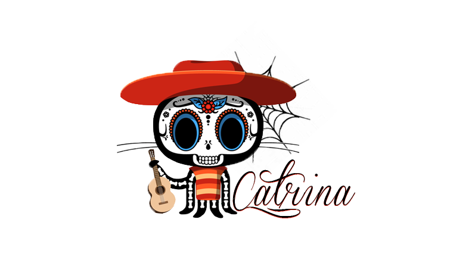

usar:
- appcache

não muito importante
- explicar como funciona o dist e o src
- Usar o flexbox.
- adicionar libs que normalmente são usadas no bower
  <!-- - handlebars -->
  <!-- - i18next -->
  <!-- - jquery -->
  <!-- - slick carousel -->

- adicionar registro de eventos do analytics
- envio para form de contato (ver se vou usar).
- adicionar gulp.
- criar modais.
- Ver todas as libs de js e usa-las.
